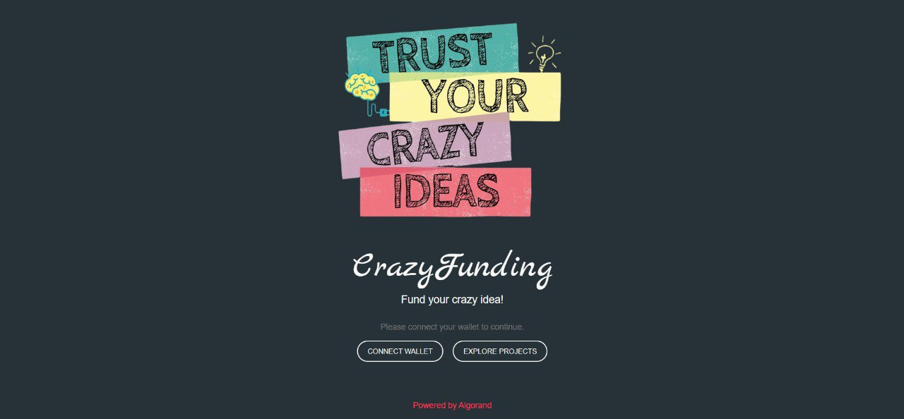

# CrazyFunding

<p align="center">  </p> <br>


This demo was realized for the 3rd italian edition of [MasterZ.|Blockchain & Digital Assets](https://www.masterzblockchain.com/). It's an on-chain crowdfunding platform: every new crowdfunding campaign deploys a stateful smart contract - which maintaines the relevant information (like start and end date) and which also deals with local user-information after opt-in - and a stateless smart contract, which acts as an escrow account, where the funds are kept locked until the end of the fundraising campaign.

The smart contracts where developed in Python using PyTEAL, while the frontend is realized using JavaScript and React. The app is currently online [here](https://crazyfunding.vercel.app/).

## Development Setup

This repo was tested with Python 3.10.4. In order to install the requirements for the backend-only demo, we recommend you create a virtual environment, activate it and then simply run

```sh
  pip install -U pip
  pip install -r requirements.txt
```
If you want to run the demo you'd need to install the Algorand (Sandbox)[https://github.com/algorand/sandbox] (requires Docker): then, from your Sandbox directory run `sh ./sandbox up`. This will create a private Algorand network, generating and funding a 3 different accounts that you can use for testing purposes. If however you need more accounts, you can use the `new_account_gen.sh` shell script, which will create a new account and move funds to it.

Finally, you can run the backend-only demo through 
```sh
  python -m src.contracts.demo
```

### Client-side

We have a React.js project bootstrapped with create-react-app. Once you clone the repositorym to run a local version of this app simply move into the relative folder and run
```sh
  npm i
  npm start
```
The app should open in [http://localhost:3000](http://localhost:3000) and be visible in your browser. Note that to interact with the Algorand blockchain you need the AlgoSigner extension for Chrome.
